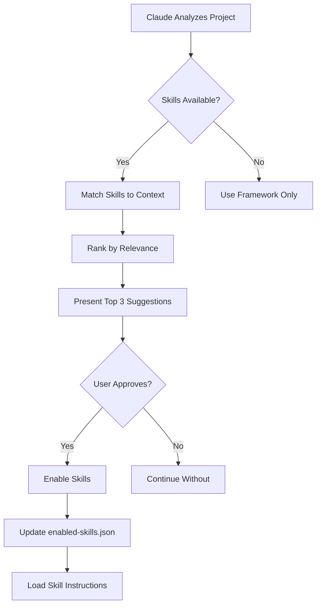

# 🎯 Anthropic Skills Integration Strategy

## Overview

This document outlines the integration strategy for incorporating [Anthropic's official Skills repository](https://github.com/anthropics/skills) into the Claude Brain Framework. This integration enhances the framework with official, community-maintained skills while maintaining our context engineering methodology.

**Version:** 1.0.0
**Last Updated:** 2025-11-11
**Status:** Proposed Integration Strategy

---

## Table of Contents

1. [What Are Anthropic Skills?](#what-are-anthropic-skills)
2. [Integration Benefits](#integration-benefits)
3. [Architecture Overview](#architecture-overview)
4. [Integration Approach](#integration-approach)
5. [Skills Directory Structure](#skills-directory-structure)
6. [Automated Skills Discovery](#automated-skills-discovery)
7. [User Permission System](#user-permission-system)
8. [Skills Lifecycle Management](#skills-lifecycle-management)
9. [Implementation Phases](#implementation-phases)
10. [Usage Examples](#usage-examples)

---

## What Are Anthropic Skills?

**Definition:** Skills are modular, self-contained packages that extend Claude's capabilities by providing specialized knowledge, workflows, and tools for repeatable tasks.

### Key Characteristics

- **Dynamic Loading:** Skills load contextually when needed
- **Self-Contained:** Each skill is a complete directory with instructions and resources
- **Progressive Disclosure:** Metadata → Instructions → Resources (minimal context overhead)
- **Official Support:** Maintained by Anthropic with community contributions

### Anthropic Skills Repository Structure

```
anthropics/skills/
├── README.md                    # Main documentation
├── agent_skills_spec.md         # Technical specification
├── THIRD_PARTY_NOTICES.md       # Licenses and attributions
├── .claude-plugin               # Plugin configuration
│
├── algorithmic-art/             # Creative generation
├── artifacts-builder/           # HTML artifacts creation
├── brand-guidelines/            # Brand consistency
├── canvas-design/               # Visual design
├── internal-comms/              # Communication templates
├── mcp-builder/                 # MCP server development
├── slack-gif-creator/           # Slack integration
├── skill-creator/               # Meta-skill for building skills
├── template-skill/              # Starting template
├── theme-factory/               # Theme generation
├── webapp-testing/              # Web app testing
│
└── document-skills/             # Document processing
    ├── docx/                    # Word documents
    ├── pdf/                     # PDF processing
    ├── pptx/                    # PowerPoint
    └── xlsx/                    # Excel spreadsheets
```

### Skill Anatomy

Each skill contains:

```
skill-name/
├── SKILL.md                     # Main skill definition (REQUIRED)
│   ├── YAML frontmatter         # name + description
│   └── Markdown instructions    # How Claude should behave
│
├── scripts/                     # (Optional) Executable code
├── references/                  # (Optional) Documentation
└── assets/                      # (Optional) Templates, icons, etc.
```

---

## Integration Benefits

### For Claude Brain Framework Users

| Benefit | Description | Impact |
|---------|-------------|--------|
| **Official Skills** | Access Anthropic-maintained skills | Proven, tested capabilities |
| **Rapid Capabilities** | Add specialized skills without custom development | Faster feature adoption |
| **Community Skills** | Benefit from community contributions | Growing ecosystem |
| **Best Practices** | Learn from official skill patterns | Better custom skill development |
| **Reduced Maintenance** | Official updates propagate automatically | Lower maintenance burden |

### For Framework Ecosystem

- **Enhanced Value Proposition:** Framework includes official skill integration
- **Standardization:** Unified skill format across projects
- **Extensibility:** Clear path for custom skill development
- **Community Growth:** Lower barrier to contributing skills

---

## Architecture Overview

### Integration Layers

```
┌─────────────────────────────────────────────────────────────┐
│                    Claude Brain Framework                    │
│                     (Context Engineering)                    │
└────────────────────────┬────────────────────────────────────┘
                         │
                         ▼
┌─────────────────────────────────────────────────────────────┐
│              Skills Integration Module (NEW)                 │
│  ┌──────────────┐  ┌──────────────┐  ┌──────────────┐      │
│  │   Discovery  │  │  Permission  │  │  Lifecycle   │      │
│  │    Engine    │  │    System    │  │  Manager     │      │
│  └──────────────┘  └──────────────┘  └──────────────┘      │
└────────────────────────┬────────────────────────────────────┘
                         │
         ┌───────────────┼───────────────┐
         ▼               ▼               ▼
┌──────────────┐  ┌──────────────┐  ┌──────────────┐
│  Anthropic   │  │    Custom    │  │   Project    │
│   Skills     │  │    Skills    │  │   Skills     │
│  (Official)  │  │  (User-Made) │  │ (Specific)   │
└──────────────┘  └──────────────┘  └──────────────┘
```

### Skill Priority Hierarchy

1. **Project-Specific Skills** (Highest Priority)
   - Location: `[PROJECT]/.claude/skills/`
   - User-customized for specific project needs

2. **Custom User Skills**
   - Location: `[FRAMEWORK]/.claude/skills/custom/`
   - User-created skills across all projects

3. **Anthropic Official Skills** (Fallback)
   - Location: `[FRAMEWORK]/.claude/skills/anthropic/` (git submodule)
   - Official, community-maintained skills

---

## Integration Approach

### Option A: Git Submodule (Recommended)

**Advantages:**
- ✅ Always up-to-date with official repository
- ✅ Version tracking and rollback capability
- ✅ Minimal storage overhead
- ✅ Easy updates via `git submodule update`

**Implementation:**
```bash
cd claude-brain-framework
git clone https://github.com/anthropics/skills claude-skills/anthropic
```

**Update Process:**
```bash
cd claude-skills/anthropic
git pull origin main
cd ../..
git add claude-skills/anthropic
git commit -m "Update Anthropic skills to latest version"
```

### Option B: Periodic Clone/Sync

**Advantages:**
- ✅ No git submodule complexity for users
- ✅ Can selectively import skills
- ✅ Simpler for non-git users

**Implementation:**
- Automated sync script checks for updates
- Users approve which skills to import
- Framework maintains version manifest

### Option C: On-Demand Download

**Advantages:**
- ✅ Minimal initial footprint
- ✅ Only download needed skills
- ✅ No git dependency

**Implementation:**
- Claude detects needed skill during task
- Prompts user for permission to download
- Caches locally for future use

### Recommended Hybrid Approach

**Initial Setup:** Git submodule for framework maintainability
**User Projects:** On-demand download with permission system
**Enterprise:** Periodic sync with approval workflow

---

## Skills Directory Structure

### Framework-Level Integration

```
claude-brain-framework/
├── core/
│   ├── METHODOLOGY.md
│   ├── SKILLS_INTEGRATION.md           # This document (NEW)
│   └── SKILLS_DISCOVERY.md             # Discovery algorithm (NEW)
│
├── claude-skills/                       # Skills integration directory (NEW)
│   ├── ANTHROPIC_SKILLS_CATALOG.md    # Complete skills reference
│   ├── anthropic/                      # Git clone (NEW)
│   │   ├── algorithmic-art/
│   │   ├── mcp-builder/
│   │   ├── document-skills/
│   │   └── ...
│   │
│   ├── custom/                         # User-created skills (NEW)
│   │   └── [user-skill-name]/
│   │
│   └── skills-manifest.json            # Tracking and versions (NEW)
│
└── templates/
    ├── SKILL_TEMPLATE.md               # Custom skill template (NEW)
    └── CLAUDE_MD_WITH_SKILLS.md        # Enhanced CLAUDE.md (NEW)
```

### Project-Level Integration

```
your-project/
├── CLAUDE.md                           # Project context
│
├── .claude/
│   ├── agents/                         # Agent recommendations
│   ├── chat-history/                   # Conversation logs
│   │
│   └── skills/                         # Project-specific skills (NEW)
│       ├── enabled-skills.json         # Approved skills list
│       ├── disabled-skills.json        # Blocked skills list
│       │
│       └── project-skills/             # Project-specific skills
│           └── [custom-skill]/
│
├── Documentation/
└── PRPs/
```

---

## Automated Skills Discovery

### Discovery Algorithm

Claude automatically discovers relevant skills based on:

#### 1. **Tech Stack Analysis**
```yaml
Laravel Project Detected:
  → Suggests: mcp-builder (for API development)
  → Suggests: webapp-testing (for testing workflows)
  → Suggests: document-skills/pdf (if invoice generation detected)

React Frontend Detected:
  → Suggests: artifacts-builder (for component previews)
  → Suggests: canvas-design (for UI work)
  → Suggests: theme-factory (for theming)

Python Project Detected:
  → Suggests: mcp-builder (for Python MCPs)
  → Suggests: document-skills/xlsx (for data processing)
```

#### 2. **Business Domain Analysis**
```yaml
E-commerce Domain:
  → Suggests: brand-guidelines (brand consistency)
  → Suggests: internal-comms (customer communication)
  → Suggests: document-skills/pdf (invoice generation)

Creative Agency:
  → Suggests: algorithmic-art (creative assets)
  → Suggests: canvas-design (design workflows)
  → Suggests: theme-factory (client theming)

SaaS Platform:
  → Suggests: webapp-testing (quality assurance)
  → Suggests: mcp-builder (API development)
  → Suggests: artifacts-builder (demo creation)
```

#### 3. **Task-Based Triggering**
```yaml
User Request: "Generate an invoice PDF"
  → Claude: "I can use the pdf skill from Anthropic's official skills repository.
             This skill specializes in PDF generation. May I enable it for this project?"

User Request: "Create an MCP server for GitHub"
  → Claude: "I can use the mcp-builder skill which provides best practices for
             MCP development. May I enable it?"

User Request: "Design a dashboard layout"
  → Claude: "I can use the canvas-design skill for visual design workflows.
             May I enable it?"
```

### Discovery Workflow



---

## User Permission System

### Permission Levels

#### 1. **Ask Every Time** (Default)
- Claude requests permission before using any skill
- User explicitly approves/denies each skill
- Safest for sensitive projects

#### 2. **Whitelist Mode**
- User pre-approves specific skills
- Claude auto-enables whitelisted skills
- Balance of safety and convenience

#### 3. **Auto-Enable Official** (Advanced)
- Automatically enable all Anthropic official skills
- Custom skills still require approval
- Fastest workflow for trusted environments

### Configuration

**Project-Level:** `.claude/skills/enabled-skills.json`
```json
{
  "version": "1.0",
  "permission_mode": "ask_every_time",
  "enabled_skills": [
    {
      "skill_name": "mcp-builder",
      "source": "anthropic",
      "enabled_at": "2025-11-11T10:30:00Z",
      "enabled_by": "user_approval"
    },
    {
      "skill_name": "pdf",
      "source": "anthropic/document-skills",
      "enabled_at": "2025-11-11T11:15:00Z",
      "enabled_by": "user_approval"
    }
  ],
  "disabled_skills": [
    {
      "skill_name": "slack-gif-creator",
      "source": "anthropic",
      "disabled_at": "2025-11-11T10:00:00Z",
      "reason": "Not needed for this project"
    }
  ],
  "auto_suggestions": true
}
```

### Permission Request Format

```
🎯 **Skill Recommendation**

I've detected that the **mcp-builder** skill from Anthropic's official repository
would be helpful for this task.

**Skill:** mcp-builder (Anthropic Official)
**Purpose:** Provides best practices and workflows for building MCP servers
**Why Relevant:** You're working on MCP server development for GitHub integration
**What It Does:** Guides through 4-phase MCP development workflow with quality checks

**Would you like me to:**
[ ] Enable this skill for this project (recommended)
[ ] Enable just for this task
[ ] Skip and continue without

You can review the skill at: .claude/skills/anthropic/mcp-builder/SKILL.md
```

---

## Skills Lifecycle Management

### Installation

```bash
# Framework-level (one-time setup)
cd claude-brain-framework
./scripts/setup-skills.sh  # Clones Anthropic skills repository

# Or manually:
git clone https://github.com/anthropics/skills claude-skills/anthropic
```

### Updates

```bash
# Check for skill updates
./scripts/check-skill-updates.sh

# Update all skills
./scripts/update-skills.sh

# Update manually:
cd claude-skills/anthropic
git pull origin main
```

### Version Tracking

**Skills Manifest:** `claude-skills/skills-manifest.json`
```json
{
  "manifest_version": "1.0",
  "anthropic_skills": {
    "repository": "https://github.com/anthropics/skills",
    "commit": "abc123def456",
    "last_updated": "2025-11-11T12:00:00Z",
    "version": "main"
  },
  "custom_skills": [
    {
      "name": "laravel-api-generator",
      "version": "1.0.0",
      "created": "2025-11-10",
      "author": "user"
    }
  ],
  "skill_usage_stats": {
    "mcp-builder": {
      "times_used": 15,
      "last_used": "2025-11-11T11:30:00Z"
    }
  }
}
```

### Deprecation Handling

When Anthropic deprecates a skill:
1. Claude detects deprecated skill in manifest
2. Warns user during next usage
3. Suggests alternative skill if available
4. Maintains backward compatibility during grace period

---

## Implementation Phases

### Phase 1: Foundation (Week 1-2)

**Goal:** Basic integration infrastructure

**Tasks:**
- [ ] Add Anthropic skills as git submodule
- [ ] Create skills directory structure
- [ ] Implement basic skills manifest
- [ ] Update VERSION_DETECTION.md to check for skills
- [ ] Create SKILLS_INTEGRATION.md (this document)
- [ ] Update INIT_PROCESS.md to include skills discovery

**Deliverables:**
- `.claude/skills/` directory structure
- `skills-manifest.json` template
- Updated framework documentation

### Phase 2: Discovery Engine (Week 3-4)

**Goal:** Automated skills recommendation

**Tasks:**
- [ ] Implement tech stack analysis algorithm
- [ ] Implement business domain analysis
- [ ] Create skill relevance ranking system
- [ ] Build permission request templates
- [ ] Create SKILLS_DISCOVERY.md documentation

**Deliverables:**
- Automated skill recommendations during init
- Task-based skill triggering
- User-friendly permission requests

### Phase 3: Permission System (Week 5-6)

**Goal:** Granular user control

**Tasks:**
- [ ] Implement `enabled-skills.json` management
- [ ] Create permission modes (ask/whitelist/auto)
- [ ] Build skill enable/disable commands
- [ ] Add skill usage tracking
- [ ] Create permission UI/UX patterns

**Deliverables:**
- Full permission system
- Project-level skill configuration
- Usage analytics

### Phase 4: Lifecycle Management (Week 7-8)

**Goal:** Updates and maintenance

**Tasks:**
- [ ] Create update checking scripts
- [ ] Implement version tracking
- [ ] Build deprecation warning system
- [ ] Create skill migration helpers
- [ ] Add rollback capabilities

**Deliverables:**
- `scripts/setup-skills.sh`
- `scripts/update-skills.sh`
- `scripts/check-skill-updates.sh`
- Update automation

### Phase 5: Documentation & Examples (Week 9-10)

**Goal:** User adoption and education

**Tasks:**
- [ ] Create comprehensive skills documentation
- [ ] Build example integrations
- [ ] Update QUICK_START.md with skills
- [ ] Create video tutorials
- [ ] Write blog post announcement

**Deliverables:**
- Complete documentation
- Example projects using skills
- Marketing materials

### Phase 6: Community Features (Week 11-12)

**Goal:** Custom skill ecosystem

**Tasks:**
- [ ] Create SKILL_TEMPLATE.md
- [ ] Build skill creation wizard
- [ ] Implement custom skill registry
- [ ] Create skill sharing system
- [ ] Launch community skill repository

**Deliverables:**
- Custom skill development tools
- Community skill marketplace
- Contribution guidelines

---

## Usage Examples

### Example 1: Auto-Discovery During Project Init

```
User: "Help me apply the Claude Brain Framework to my Laravel e-commerce project"

Claude: "I'll initialize the framework for your Laravel e-commerce project.

🎯 **Skills Recommendations**

Based on your tech stack and domain, I recommend these official Anthropic skills:

1. **mcp-builder** - For building API integrations
2. **document-skills/pdf** - For invoice and receipt generation
3. **webapp-testing** - For automated testing workflows
4. **brand-guidelines** - For maintaining brand consistency

Would you like me to enable these skills? (You can always enable/disable later)
[ ] Enable all recommended (fastest)
[ ] Let me choose individually
[ ] Skip skills for now

I'll continue with the initialization process..."
```

### Example 2: Task-Based Skill Triggering

```
User: "I need to generate PDF invoices for customer orders"

Claude: "I can help you implement PDF invoice generation.

🎯 **Skill Recommendation**

I've found the **document-skills/pdf** skill from Anthropic's official repository
that specializes in PDF document generation.

**What it provides:**
- PDF generation best practices
- Template-based document creation
- Professional formatting guidelines
- Common invoice patterns

**May I enable this skill for your project?**
[ ] Yes, enable pdf skill (recommended)
[ ] No, implement without skill

(You can review: .claude/skills/anthropic/document-skills/pdf/SKILL.md)"
```

### Example 3: Managing Enabled Skills

```
User: "What skills are currently enabled?"

Claude: "Here are the currently enabled skills for this project:

**Enabled Skills:**
1. ✅ mcp-builder (Anthropic Official)
   - Enabled: 2025-11-10
   - Used: 15 times
   - Last used: 2 hours ago

2. ✅ document-skills/pdf (Anthropic Official)
   - Enabled: 2025-11-11
   - Used: 3 times
   - Last used: 30 minutes ago

**Available Skills:**
- webapp-testing
- brand-guidelines
- canvas-design
- [12 more...]

Would you like to:
[ ] Enable additional skills
[ ] Disable a skill
[ ] View skill details
[ ] Update skills to latest version"
```

### Example 4: Custom Skill Creation

```
User: "I want to create a custom skill for our Laravel API patterns"

Claude: "Great! I'll help you create a custom skill using the skill-creator
skill and our framework template.

Let me ask you a few questions:

1. What should we name this skill? (e.g., 'laravel-api-patterns')
2. What specific Laravel patterns should it enforce?
3. Do you have example code I should learn from?
4. Should this skill include scripts, references, or just instructions?

Once we create it, I'll save it to:
.claude/skills/custom/laravel-api-patterns/

This skill will be available across all your projects using this framework."
```

---

## Integration with Existing Framework Components

### CLAUDE.md Updates

Add new section to project CLAUDE.md:

```markdown
## 🎯 ENABLED SKILLS

This project uses the following Anthropic official skills:

### Development Skills
- **mcp-builder** - MCP server development best practices
  - Usage: API integration development
  - Status: Active

### Document Processing Skills
- **document-skills/pdf** - PDF generation and processing
  - Usage: Invoice and receipt generation
  - Status: Active

**Skills Management:**
- Configuration: `.claude/skills/enabled-skills.json`
- View all available skills: Ask Claude to list available skills
- Enable/disable skills: Ask Claude to modify skill settings
```

### INIT_PROCESS.md Updates

Add skills discovery phase:

```markdown
### Phase 4: Skills Discovery (NEW)

Claude analyzes your project and tech stack to recommend relevant skills:

**Questions:**
- "Would you like me to scan for relevant official skills?"
- "Which of these recommended skills should I enable?"
- "Do you have any custom skills you'd like to use?"

**Outputs:**
- `.claude/skills/enabled-skills.json`
- Skills integrated into workflow
- Permission preferences configured
```

### BEHAVIORAL_RULES.md Updates

```markdown
### Skills Usage Behavior

1. **Discovery:** Proactively suggest relevant skills during init
2. **Permission:** Always ask before first-time skill enablement
3. **Context:** Load skill instructions only when needed
4. **Transparency:** Inform user when using a skill
5. **Updates:** Notify user of available skill updates
```

---

## Measuring Success

### Key Metrics

| Metric | Target | Measurement |
|--------|--------|-------------|
| **Skill Adoption Rate** | 60% of projects use ≥1 skill | `enabled-skills.json` analysis |
| **Time to Capability** | 50% reduction vs custom implementation | User surveys |
| **Framework Differentiation** | Unique feature vs competitors | Market analysis |
| **User Satisfaction** | 4.5+ rating for skills feature | User feedback |
| **Skill Usage Growth** | 20% MoM increase | Usage stats in manifest |

### User Feedback Collection

- In-app skill rating system
- Quarterly skills usage survey
- GitHub issues for skill requests
- Community Discord feedback channel

---

## Risks & Mitigations

### Risk 1: Anthropic Repository Changes

**Risk:** Anthropic restructures or deprecates skills repo
**Mitigation:**
- Pin to specific commit for production
- Monitor repo for changes
- Maintain skill version manifest
- Build fallback to cached versions

### Risk 2: Skill Conflicts

**Risk:** Multiple skills provide overlapping functionality
**Mitigation:**
- Clear skill priority hierarchy
- Conflict detection in discovery engine
- User override capabilities
- Skill compatibility matrix

### Risk 3: Security Concerns

**Risk:** Skills execute code or access sensitive data
**Mitigation:**
- Skill sandboxing for script execution
- Explicit permission system
- Security audit of official skills
- User control over skill permissions

### Risk 4: Context Overhead

**Risk:** Too many skills load unnecessary context
**Mitigation:**
- Progressive disclosure (metadata → full load)
- Lazy loading of skill instructions
- Token usage tracking per skill
- User-configurable skill limits

### Risk 5: Maintenance Burden

**Risk:** Keeping skills updated becomes overhead
**Mitigation:**
- Automated update checking
- Quarterly review schedule
- Deprecation grace periods
- Community contribution to maintenance

---

## Future Enhancements

### Short-term (3-6 months)

- **Skill Marketplace:** Web interface for browsing skills
- **Skill Analytics:** Dashboard showing usage patterns
- **Skill Templates:** More templates for common use cases
- **Integration Testing:** Automated tests for skill compatibility

### Medium-term (6-12 months)

- **Community Skills:** User-contributed skills repository
- **Skill Composer:** Visual tool for creating skills
- **Multi-Project Skills:** Share skills across project teams
- **Skill Performance:** Optimize skill loading and context usage

### Long-term (12+ months)

- **AI-Generated Skills:** Claude creates skills from natural language
- **Skill Marketplace API:** Programmatic skill discovery/installation
- **Enterprise Skill Registry:** Private skill repositories for companies
- **Skill Versioning:** Semantic versioning with migration tools

---

## Conclusion

Integrating Anthropic's official Skills repository into the Claude Brain Framework provides:

✅ **Immediate Value:** Access to proven, maintained capabilities
✅ **Framework Enhancement:** Unique differentiator in the ecosystem
✅ **User Empowerment:** Choose from official and custom skills
✅ **Community Growth:** Foundation for skill-sharing ecosystem
✅ **Future-Proofing:** Benefit from Anthropic's ongoing development

**Recommended Next Steps:**

1. **Review this document** with stakeholders
2. **Approve integration approach** (Git submodule recommended)
3. **Begin Phase 1 implementation** (2 weeks)
4. **Create proof-of-concept** with 3 key skills
5. **Gather early user feedback** before full rollout

---

**Document Version:** 1.0.0
**Last Updated:** 2025-11-11
**Maintainer:** Claude Brain Framework Team
**Feedback:** [GitHub Issues](https://github.com/Marcosmenm/claude-brain-framework/issues)
